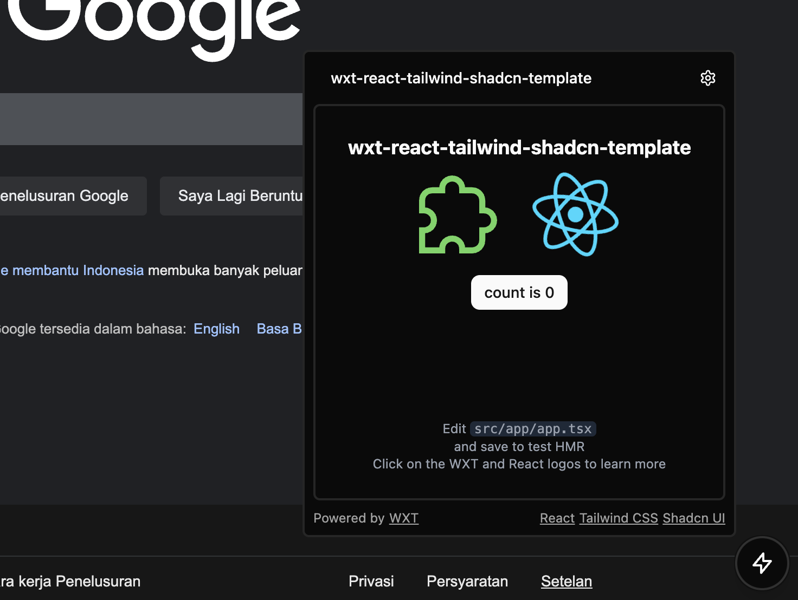
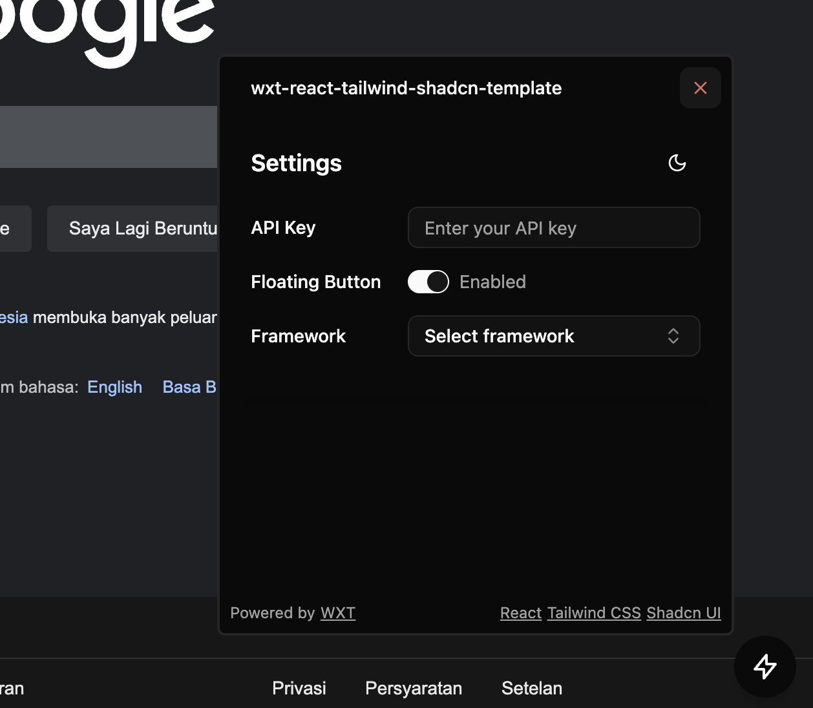
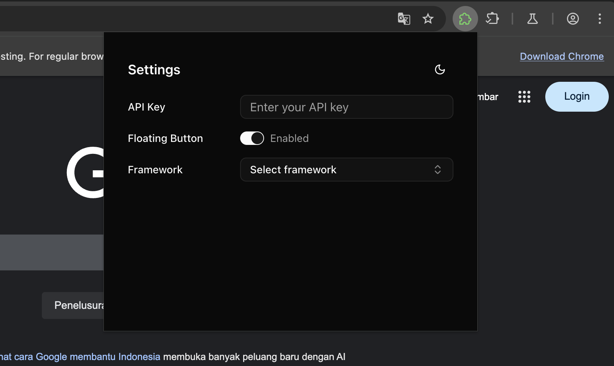

# WXT + React + Tailwind CSS + shadcn/ui

A modern, opinionated template for building browser extensions with WXT, React, TypeScript, Tailwind CSS, and shadcn/ui components.

## 🚀 Features

- ⚡ Built with [WXT](https://wxt.dev/) - The next-gen browser extension framework
- ⚛️ [React 19](https://react.dev/) with TypeScript for type safety
- 🎨 [Tailwind CSS](https://tailwindcss.com/) for utility-first styling
- ✨ [shadcn/ui](https://ui.shadcn.com/) components for beautiful, accessible UI
- 🎭 Dark mode support
- 🔥 Hot reloading for development
- 📦 Optimized production builds

## 📸 Screenshots

### Content UI - Main



### Content UI - Settings



### Popup UI



## 🛠️ Getting Started

1. **Clone the repository (or `Use this template`)**

   ```bash
   git clone https://github.com/husniadil/wxt-react-tailwind-shadcn-template.git
   cd wxt-react-tailwind-shadcn-template
   ```

2. **Install dependencies**

   ```bash
   pnpm install
   ```

3. **Configure Chrome for Testing**

   > ⚠️ **Important**: This template requires Chrome for Testing. Regular Chrome/Chromium installations are not supported.

   1. Download Chrome for Testing from: https://googlechromelabs.github.io/chrome-for-testing/#stable
   2. Extract the downloaded archive

   Create a `web-ext.config.ts` file in the root directory with the following content, updating the path to point to your Chrome for Testing binary:

   ```typescript
   import { defineWebExtConfig } from "wxt";

   // For Mac ARM users:
   export default defineWebExtConfig({
     binaries: {
       chrome:
         "/path/to/chrome-mac-arm64/Google Chrome for Testing.app/Contents/MacOS/Google Chrome for Testing",
     },
   });

   // For Windows users (uncomment and modify as needed):
   // export default defineWebExtConfig({
   //   binaries: {
   //     chrome: "C:\\path\\to\\chrome-win64\\chrome.exe"
   //   },
   // });
   ```

   > 💡 **Note**: The exact path will vary based on your OS and where you extracted Chrome for Testing.

4. **Start development server**

   ```bash
   pnpm run dev
   ```

5. **Build for production**
   ```bash
   pnpm run build
   ```

## 📁 Project Structure

```
.
├── public/                 # Static assets
│   ├── icon/               # Extension icons in various sizes
├── screenshots/            # Extension screenshots
├── src/
│   ├── app/                # App content / business logic
│   ├── assets/             # Static assets used in the application
│   ├── components/         # Reusable React components
│   │   ├── settings/       # Settings components
│   │   └── ui/             # shadcn/ui components
│   ├── constants/          # Application constants
│   ├── context/            # React context providers
│   ├── data/               # Dummy data
│   ├── entrypoints/        # Extension entry points
│   │   ├── background/     # Background script
│   │   ├── content/        # Content scripts
│   │   └── popup/          # Popup UI
│   ├── hooks/              # Custom hooks
│   ├── lib/                # Utility functions
│   ├── styles/             # Global styles and CSS
│   └── types/              # TypeScript type definitions
├── .eslint.config.js       # ESLint configuration
├── components.json         # shadcn/ui configuration
├── package.json            # Project manifest
├── postcss.config.mjs      # PostCSS configuration
├── tsconfig.json           # TypeScript configuration
├── web-ext.config.ts       # web-ext configuration
└── wxt.config.ts           # WXT configuration
```

## 🎨 Styling

- Uses Tailwind CSS for utility-first styling
- Custom themes and styles can be added in `src/styles/globals.css`
- Dark mode is enabled by default and can be toggled using the `useTheme` hook

## 🧩 Adding shadcn/ui Components

To add new shadcn/ui components:

1. Run the component addition command:
   ```bash
   pnpm dlx shadcn@latest add [component-name]
   ```
2. Import and use the component in your React components

## 📝 License

MIT

## 🙏 Acknowledgments

- [WXT](https://wxt.dev/)
- [React](https://react.dev/)
- [shadcn/ui](https://ui.shadcn.com/)
- [Tailwind CSS](https://tailwindcss.com/)
- [Building Modern Cross-Browser Extensions](https://aabidk.dev/blog/building-modern-cross-web-extensions-introduction/) by [Aabid K.](https://github.com/aabidk20/command-palette)
